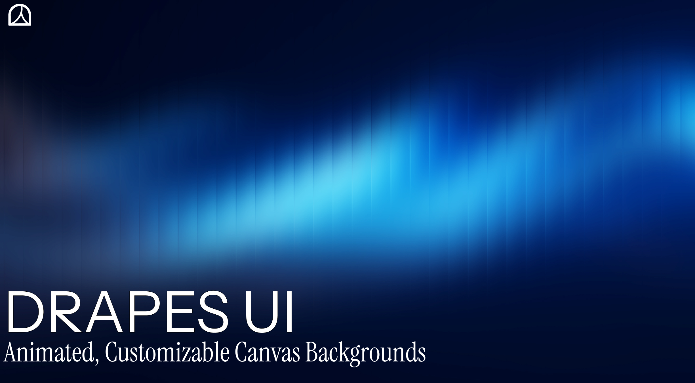

<!-- # Drapes UI-->

> _**Curtains up for animated canvases**_

<div align="center">
  
<p align="left">
  <strong>Drapes makes it easy to add beautiful, animated canvas backgrounds to your websites and apps.</strong>
  Customize colors, motion, and effects in seconds — then drop them straight into your project with clean, ready-to-use code.
  <br/><br/>
  <em>Perfect for developers and designers using React, Next.js, . Built for anyone who wants great-looking backgrounds without the hassle.</em>
</p>
</div>

## Features

- **Animated Canvas Backgrounds** – Explore a growing library of smooth, modern canvas animations and shader-driven effects.
- **Customizable Controls** – Tweak colors, speed, density, shapes, and more with easy configuration options.
- **Favorites System** – Save and manage your favorite backgrounds for quick access anytime.
- **One-Click Copy** – Instantly copy ready-to-use code snippets for React, Next.js, or plain HTML.
- **Zero Dependencies** – Pure Canvas and shaders implementations 
- **Shader Effects** – Unlock advanced WebGL and shader-powered visuals for truly unique backgrounds.
- **Live Preview** – Adjust settings and see changes in real time before adding them to your project.
- **Developer-First** – Clean, production-ready code designed for simple integration.

## Getting Started

### Prerequisites
- Node.js (v20 or higher recommended)
- pnpm, npm 

### Installation

```bash
# Clone the repository
git clone https://github.com/NetMods/Drapes-UI
cd Drapes-UI 

# Install dependencies
pnpm install # or npm install or yarn install
```

### Running the Application

```bash
pnpm dev # or npm run dev or yarn dev
```

The application will be available at [http://localhost:3000](http://localhost:3000) by default.


## Project Structure

```
actions/       # Action to automatically save thumbnails for backgrounds 
app/           
  bg/          # background route for preview of backgrounds 
  test/        # Testing Route for new Backgrounds 
backgrounds/   # Backgrounds Folder
components/    # Reusable UI and layout components
hooks/         # Custom React hooks
lib/           # Utility functions
public/        # Images and thumbnails for backgrounds 
...
```
## Contributing

Contributions are welcome. Please open issues or pull requests for new features, bug fixes, or improvements.

1. Fork the repository
2. Create your feature branch (`git checkout -b feature/YourFeature`)
3. Commit your changes (`git commit -am 'Add new feature'`)
4. Push to the branch (`git push origin feature/YourFeature`)
5. Open a Pull Request

See our [contribution guidelines for background](CONTRIBUTING.md) for details.


## License

This project is open source and available under the [MIT License](LICENSE).


## Built By

- Twitter(X): [@Dharmeshwr](https://x.com/Dharmeshwr), [@Monkey_d_aryan](https://x.com/Monkey_d_aryan)
- GitHub: [@dharmeshwr](https://github.com/dharmeshwr), [@aryankumar07](https://github.com/aryankumar07)

If you like this project, consider giving it a ⭐️ on GitHub and sharing it with others!
> _**Happy coding!**_
